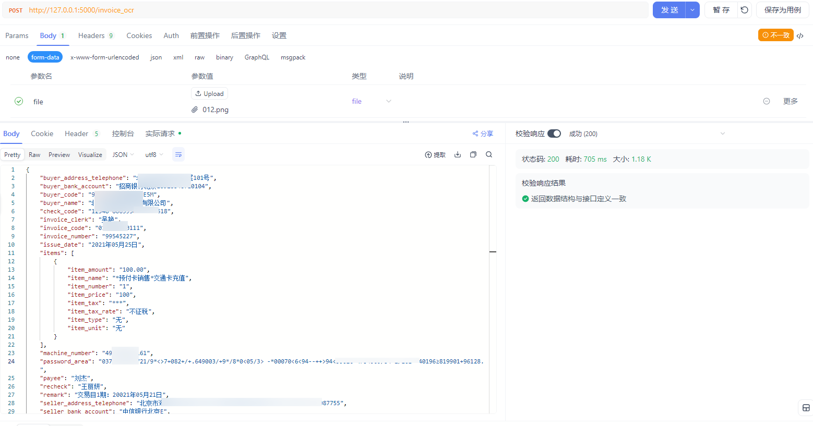
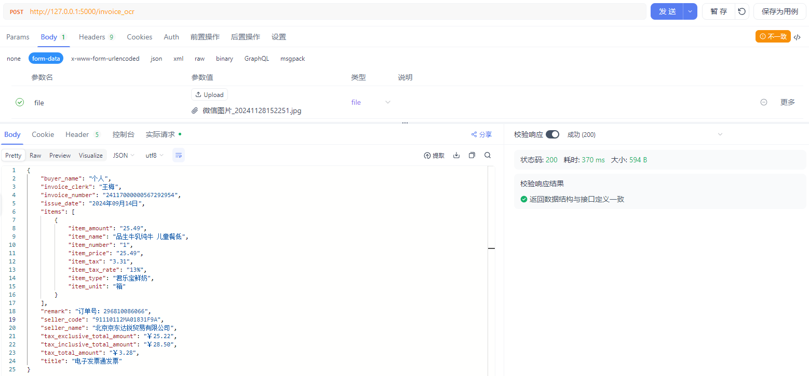
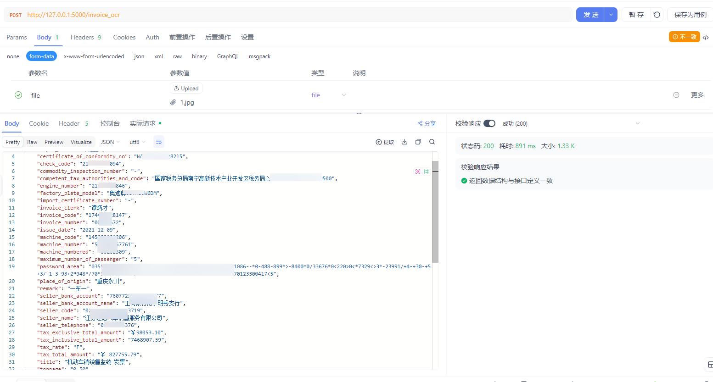
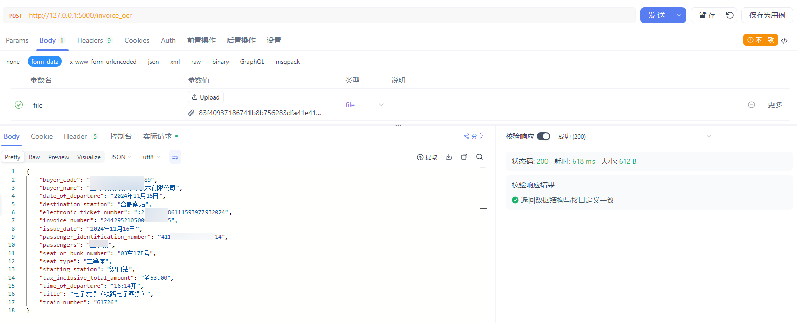

# myocr2-invoice

#### 介绍
发票OCR识别，支持【增值发票、普通发票、机动车发票、铁路发票】，实现方式使用RT-DERTv2目标检测提取关键位置发票信息，PaddleOCR根据提取的位置进行文字识别。
支持图片和PDF识别，主要识别了发票标题、发票代码、发票号码、开票日期、购买方名称、购买方识别号、销售方名称、销售方识别号、含税金额、不含税金额、税费等信息。

#### 软件架构
RT-DERTv2+PaddleOCR+Flask+easyofd

#### 最新动态
 - 2025.06.19: paddlepaddle 2.6.2=>paddlepaddle 3.0.0、PaddleOCR 2.9=>PaddleOCR 3.0.2、PPOCR-V4=>PPOCR-V5
#### 安装教程
Python3.9环境

  1. 安装paddlepaddle 3.0.0版本, 推荐使用GPU, GPU/CPU切换public_info.py字段device的值。 根据官网中配置信息下载对应的，https://www.paddlepaddle.org.cn/install/quick?docurl=/documentation/docs/zh/install/pip/windows-pip.html  
  2. pip install -r requirements.txt  

[//]: # (3. pip install paddleocr)
  3. (1)gunicorn -w 4 -b 0.0.0.0:5000 main:app 端口可以自由设置  
   (2)python main.py  
   以上都可以启动服务  
  4. 启动成功发送地址测试(post请求，file参数)http://127.0.0.1:5000/invoice_ocr

#### 发票识别截图
- 增值发票识别

- 普通发票识别

- 机动车发票识别

- 铁路发票识别

#### 后续
目前训练数据种类比较少，后续逐步完善。

#### 注意注意注意
如需paddlepaddle 3.0.0以下版本请切换到PPOCR-V4分支

