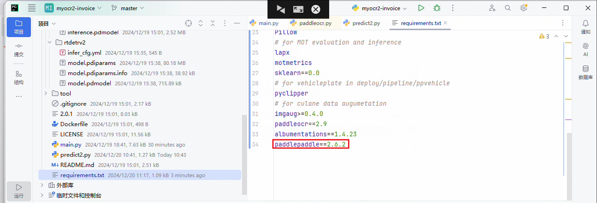
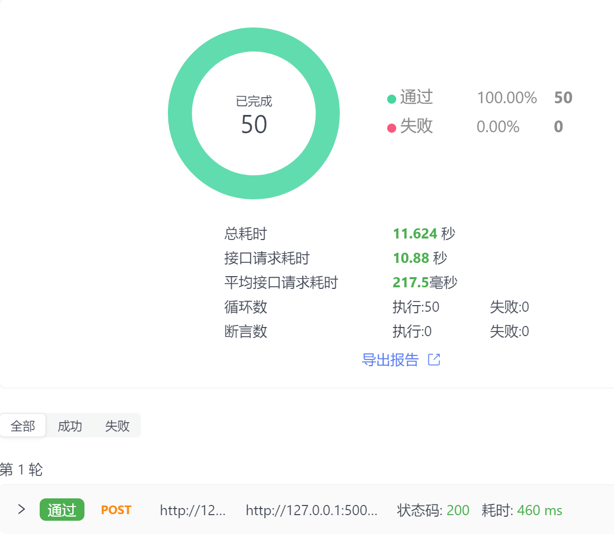

# myocr2-invoice

#### 介绍
发票OCR识别，实现方式使用RT-DERTv2目标检测提取关键位置发票信息，PaddleOCR根据提取的位置进行文字识别。
支持图片和PDF识别，主要识别了发票标题、发票代码、发票号码、开票日期、购买方名称、购买方识别号、销售方名称、销售方识别号、含税金额、不含税金额、税费信息。

#### 说明
由于YOLO和PaddleOCR无法同时使用GPU加速, 使用RT-DERTv2替代YOLO, 在GPU环境下耗时变为二百多毫秒, 而且RT-DERT的开源协议是Apache-2.0 license使用起来顾虑会更少

#### 软件架构
RT-DERTv2+PaddleOCR+Flask

#### 安装教程

Python3.9环境，建议使用Anaconda管理python环境

1. pip install -r requirements.txt  
2. 若使用gpu， 请注释掉requirements.txt的paddlepaddle，根据官网中配置信息下载对应的，https://www.paddlepaddle.org.cn/install/quick?docurl=/documentation/docs/zh/install/pip/windows-pip.html  
(图片)

[//]: # (3. pip install paddleocr)
4. (1)gunicorn -w 4 -b 0.0.0.0:5000 main:app 端口可以自由设置  
   (2)python main.py  
   以上都可以启动服务  
5. 启动成功发送地址测试http://127.0.0.1:5000/invoice_ocr

#### 测试截图

经测试GPU环境下平均二百多毫秒，CPU环境下一秒左右
(GPU环境平均耗时)

#### 后续
目前训练数据种类比较少，后续逐步完善。

#### 自己训练模型
训练RT-DETRv2检测模型可以使用auto_label.py进行半自动标注，标注完成后使用PPOCRLabel打开directory变量的目录进行微调即可，调整完成后转换为coco格式数据就可以训练啦，后续会整理提供格式转换的脚本。

#### 注意注意注意

